# 超图服务调用踩坑归集

- [iServer 开发指南: API 参考](http://support.supermap.com.cn/DataWarehouse/WebDocHelp/iServer/API/iServer_API_reference.htm)
- [iServer 服务能力介绍](http://support.supermap.com.cn/DataWarehouse/WebDocHelp/iServer/Appendix/function_introduce.htm)

## 1. 地图服务 (MapService)

地图服务名称通常以 **map-xxx** 开头， 如 `http://192.168.110.130:8091/iserver/services/map-DiTu/`

配置通用的服务接口:

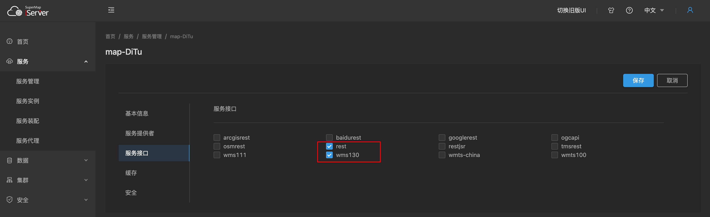

目前项目主要使用的接口有: `rest` 和 `wms130`

::: warning 不赞成使用 `wms110`

`SuperMap` 的 `wms110` 版本服务支持该值的目的是向后兼容

:::

### zxyTileImage 瓦片服务

- [iServe zxyTileImage 瓦片服务](http://support.supermap.com.cn/DataWarehouse/WebDocHelp/iServer/mergedProjects/SuperMapiServerRESTAPI/root/maps/map/zxyTileImage/zxyTileImage.htm)

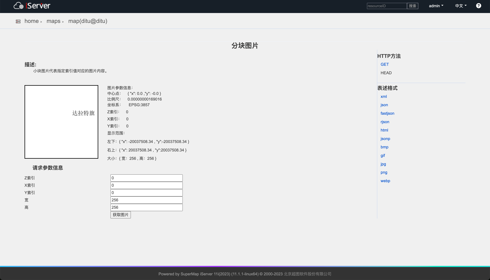

示例服务地址: `http://192.168.110.130:8091/iserver/services/map-DiTu/rest/maps/ditu@ditu/zxyTileImage`

```vue
<script lang="ts" setup>
import { Point } from '@vuesri/core/arcgis'
import { VaSceneView } from '@vuesri/core/components/scene-view'
import { VaSupmapZxyTileImage } from '@vuesri/core/components/supmap-zxy-tile-image'
import { VaTdtBasemap } from '@vuesri/core/components/tdt-basemap'
import { ref } from 'vue'

const url = 'http://192.168.110.130:8091/iserver/services/map-DiTu/rest/maps/ditu@ditu/zxyTileImage'

const formData = ref({
  url,
  transparent: true,
  format: 'png',
})

const viewOptions: __esri.SceneViewProperties = {
  center: new Point({
    x: 12097130.73238203,
    y: 4750187.806440521,
    spatialReference: {
      wkid: 3857,
    },
  }),
  zoom: 16,
}
</script>

<template>
  <VaSceneView :default-options="viewOptions">
    <VaTdtBasemap
      type="vec_w"
      :spatial-reference="{
        wkid: 3857,
      }"
    />

    <VaSupmapZxyTileImage
      :url="formData.url"
      :transparent="formData.transparent"
      :format="formData.format"
      :opacity=".8"
    />
  </VaSceneView>
</template>
```

### wms130

- [iServer WMS 服务](http://support.supermap.com.cn/DataWarehouse/WebDocHelp/iServer/API/WMS/WMS_introduce.htm)

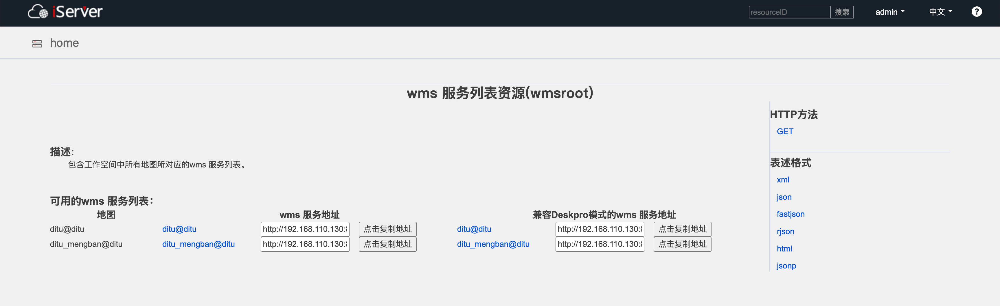

示例服务地址: `http://192.168.110.130:8091/iserver/services/map-DiTu/wms130`

```vue
<script lang="ts" setup>
import { VaSceneView } from '@vuesri/core/components/scene-view'
import { VaTdtBasemap } from '@vuesri/core/components/tdt-basemap'
import { VaWmsLayer } from '@vuesri/core/components/wms-layer'

const url = 'http://192.168.110.130:8091/iserver/services/map-DiTu/wms130'
const layerName = 'ditu@ditu'
</script>

<template>
  <VaSceneView>
    <VaTdtBasemap
      type="vec_w" :anno="false" :spatial-reference="{
        wkid: 3857,
      }"
    />
    <VaWmsLayer
      :url="url" :sublayers="[
        {
          name: layerName,
          visible: true,
          queryable: true,
          popupEnabled: true,
        },
      ]"
    />
  </VaSceneView>
</template>
```

## 数据服务 (DataService)

数据服务名称通常以 **data-xxx** 开头， 如 `http://192.168.110.130:8091/iserver/services/data-cs/`

配置通用的服务接口:

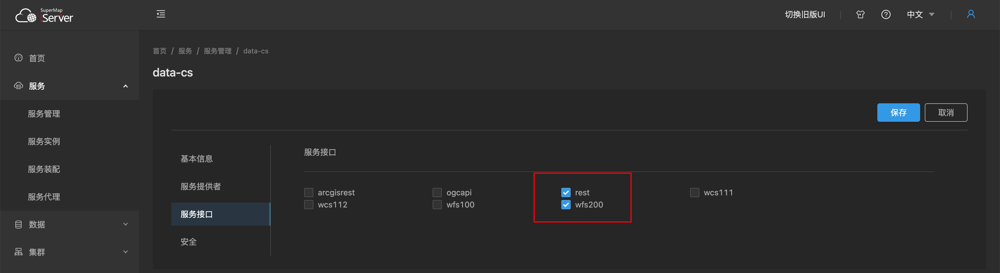

### rest 服务

目前主要用于获取数据服务要素

- 数据集格式: 数据源名称:数据集名称， 如 `erdscs:ordos_nrs_data_ggfwssd`

1. 示例一: 获取所有的数据服务要素结果

   ```js
   const myHeaders = new Headers()
   myHeaders.append('User-Agent', 'Apifox/1.0.0 (https://apifox.com)')
   myHeaders.append('Content-Type', 'application/json')
   myHeaders.append('Accept', '*/*')
   myHeaders.append('Host', '192.168.110.130:8091')
   myHeaders.append('Connection', 'keep-alive')

   const raw = JSON.stringify({
     getFeatureMode: 'SQL',
     queryParameter: '{}',
     datasetNames: '[\'erdscs:ordos_nrs_data_ggfwssd\']'
   })

   const requestOptions = {
     method: 'POST',
     headers: myHeaders,
     body: raw,
     redirect: 'follow'
   }

   fetch('http://192.168.110.130:8091/iserver/services/data-cs/rest/data/featureResults.geojson?returnContent=true', requestOptions)
     .then(response => response.text())
     .then(result => console.log(result))
     .catch(error => console.log('error', error))
   ```

   接口返回类型: FeatureCollection

   ```json
   {
     "type": "FeatureCollection",
     "features": [
       {
         "geometry": {
           "coordinates": [
             109.46437223599997,
             39.783583728999986
           ],
           "type": "Point"
         },
         "id": "1",
         "type": "Feature",
         "properties": {
           "OBJECTID": "1",
           "SSGM": "1779.55",
           "YDMJ": "1779.55",
           "XZQMC": "漫赖村",
           "BZ": " ",
           "YSDM": "2090020521",
           "XZQDM": "150602100200",
           "GHZT": "01",
           "SSLX": "其他基本公共服务设施",
           "BSM": "15060200400000001",
           "SSDM": "2900"
         }
       }
     ]
   }
   ```

### wfs2.0 服务

- [iServer WFS 服务](http://support.supermap.com.cn/DataWarehouse/WebDocHelp/iServer/API/WFS/WFS_introduce.htm)

示例服务地址: `http://192.168.110.130:8091/iserver/services/data-cs/wfs200`

```vue
<script lang="ts" setup>
import { VaSceneView } from '@vuesri/core/components/scene-view'
import { VaTdtBasemap } from '@vuesri/core/components/tdt-basemap'
import { VaWfsLayer } from '@vuesri/core/components/wfs-layer'

const url = 'http://192.168.110.130:8091/iserver/services/data-cs/wfs200'
const layerName = 'ordos_nrs_data_ggfwssd'
</script>

<template>
  <VaSceneView>
    <VaTdtBasemap
      type="vec_w" :anno="false" :spatial-reference="{
        wkid: 3857,
      }"
    />
    <VaWfsLayer :url="url" :name="layerName" geometry-type="polygon" :popup-enabled="true" />
  </VaSceneView>
</template>
```

## 三维服务 (SceneService)

三维服务名称通常以 **3D-xxx** 开头， 如 `http://192.168.110.130:8091/iserver/services/3D-ThreeDTilesCache-tileset/rest`

配置只有一个 **rest** 服务接口:

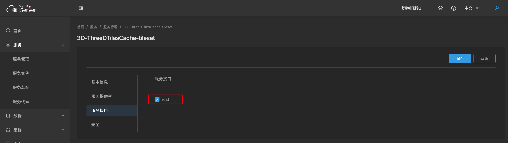

示例服务地址: `http://192.168.110.130:8091/iserver/services/3D-ThreeDTilesCache-tileset/rest/realspace/datas/tileset/config`

```vue
<script lang="ts" setup>
import { VaIntegratedMesh3dTilesLayer } from '@vuesri/core/components/integrated-mesh-3d-tiles-layer'
import { useIntegratedMesh3dTilesLayer } from '@vuesri/core/composables'
import { useRequestInterceptor } from '@vuesri/core/composables/config'

const layer = useIntegratedMesh3dTilesLayer()

const basePattern = layer.url.replace('/config', '')
const regex = new RegExp(`${basePattern}/.*\\.(json|b3dm)$`)

const { interceptorToggle } = useRequestInterceptor({
  urls: [regex],
  before: (e) => {
    // 拼上'/data/path/'前缀
    e.url = e.url.replace(basePattern, `${basePattern}/data/path`)
  },
})
interceptorToggle.add()

const url = 'http://192.168.110.130:8091/iserver/services/3D-ThreeDTilesCache-tileset/rest/realspace/datas/tileset/config'
</script>

<template>
  <VaIntegratedMesh3dTilesLayer
    v-if="url" :url="url"
  />
</template>

<style></style>
```

## 问题归集

### wms 服务通过 sld_body 修改样式不生效

问题描述:

尝试用 SLD_BODY 自定义 wms 服务的样式， GetMap 请求格式如下，图层样式没有渲染

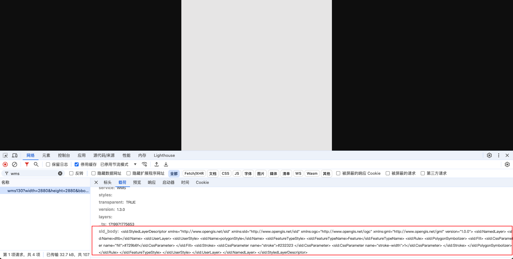

问题原因:

wms 服务目前只支持已定义的图层样式

[iServer GetMap 请求](http://support.supermap.com.cn/DataWarehouse/WebDocHelp/iServer/API/WMS/WMS130/GetMap/GetMap_request.htm)

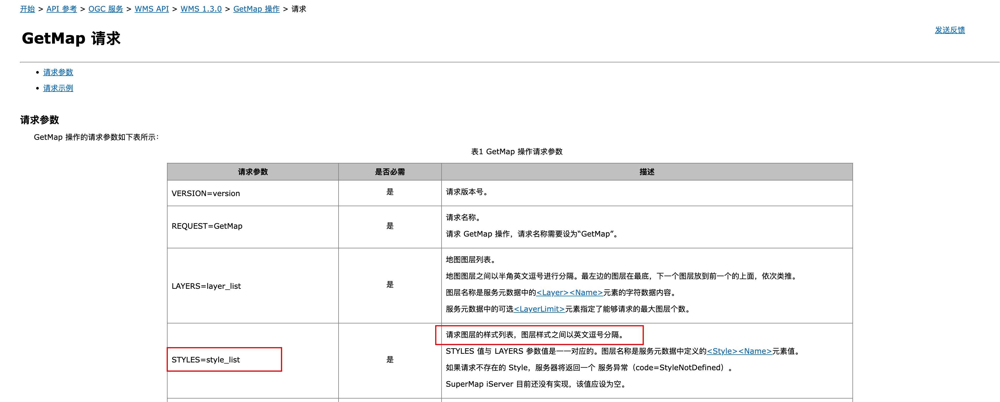

### 地图服务获取 geojson 表述格式错误

问题描述:

请求url /iserver/services/map-text/rest/FZJZSSD@cs.geojson 与资源 root 的 url 模板不匹配

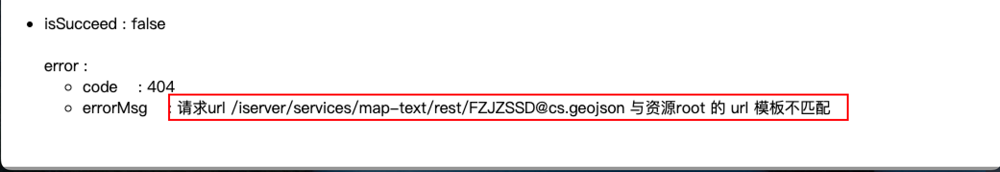

问题原因:

- 数据服务的要素才有 geojson 表述格式，是否支持 geojson 格式，可以看右侧目录栏
- 地图服务和数据服务属于不同的服务类型，需要重新发布服务并勾选 rest 接口

### 报错：400 ，msg：对象已经被释放

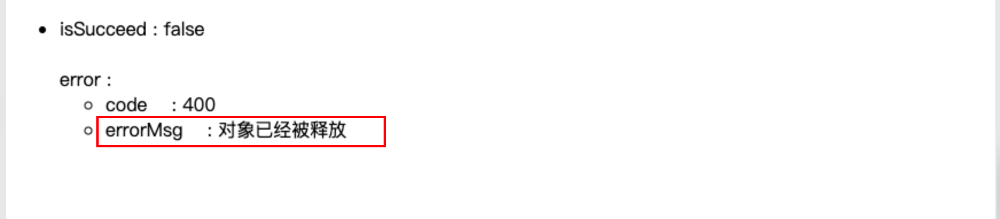

问题原因:

可能是数据库数据不同步，先用文件型数据源试下接口请求是否正确

### wfs2.0 服务获取描述文档成功，获取要素的时候报错

问题描述:

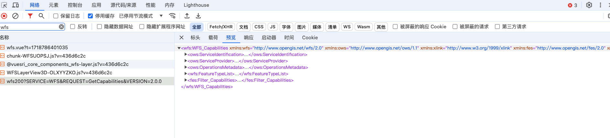

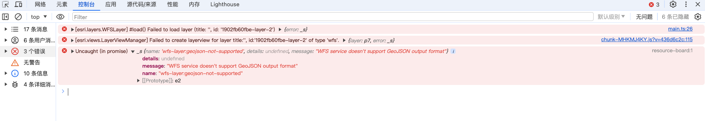

问题原因:

- iserver 版本为 `iserver 2023 11i` ，不支持 geojson 输出

supermap wfs2.0 执行 GetFeature 操作支持 `outputFormat=json` 输出，但是 xml 表述文档中没有加上`<ows:Value>json</ows:Value>`， 猜测是这个原因导致 arcgis 提示不支持

升级 `iserver` 版本

```text
链接：https://pan.baidu.com/s/1_s4IyXvkx9hFZH3ORwTULA?pwd=u19m
提取码：u19m
```

### wfs2.0服务的点击事件拿不到要素全部属性值

问题描述:

有个需求为点击地块展示详情，但是获取到的要素只有部分属性值

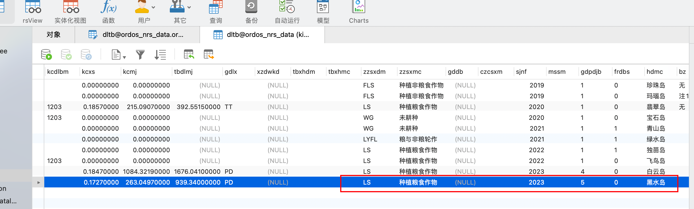

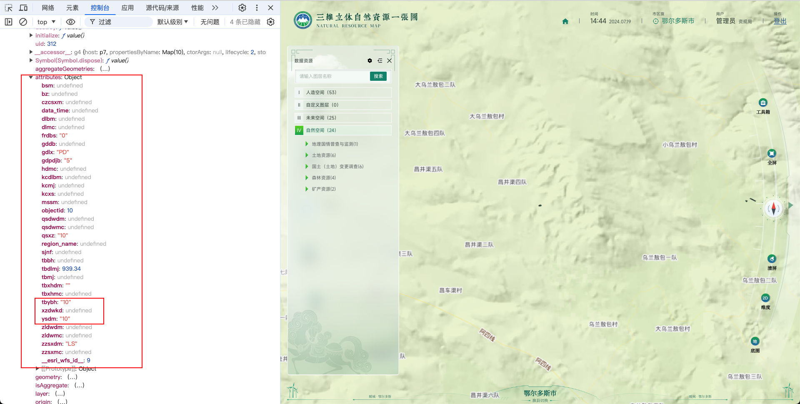

问题原因:

`iServer` 的 `GetFeature` 请求使用 `FILTER` 参数,编码语言为 `urn:ogc:def:query Language:OGC-FES:Filter`

- [iServer FILTER 示例](http://support.supermap.com.cn/DataWarehouse/WebDocHelp/iServer/API/WFS/WFS200/GetFeature/FILTER.htm)

可以通过 `esri_wfs_id` 与 `表名` 传给后端，后端根据 `esri_wfs_id` 查询数据库，返回结果

### 如何获取地图当前状态的基本信息

- [iServer map](http://support.supermap.com.cn/DataWarehouse/WebDocHelp/iServer/mergedProjects/SuperMapiServerRESTAPI/root/maps/map/map.htm)

获取服务的四至范围，用来实现服务跳转定位

```js
const myHeaders = new Headers()
myHeaders.append('User-Agent', 'Apifox/1.0.0 (https://apifox.com)')
myHeaders.append('Content-Type', 'application/json')
myHeaders.append('Accept', '*/*')
myHeaders.append('Host', '192.168.110.130:8091')
myHeaders.append('Connection', 'keep-alive')

const requestOptions = {
  method: 'GET',
  headers: myHeaders,
  redirect: 'follow'
}

fetch('http://192.168.110.130:8091/iserver/services/map-cs/rest/maps/dltb.rjson', requestOptions)
  .then(response => response.text())
  .then(result => console.log(result))
  .catch(error => console.log('error', error))
```

接口返回：

```json
{
  "prjCoordSys": {
    "distanceUnit": "METER",
    "projectionParam": null,
    "epsgCode": 4490,
    "coordUnit": "DEGREE",
    "name": "GCS_China_2000",
    "projection": null,
    "type": "PCS_EARTH_LONGITUDE_LATITUDE",
    "coordSystem": {
      "datum": {
        "name": "D_China_2000",
        "type": "DATUM_CHINA_2000",
        "spheroid": {
          "flatten": 0.003352810681182319,
          "name": "CGCS2000",
          "axis": 6378137,
          "type": "SPHEROID_CHINA_2000"
        }
      },
      "unit": "DEGREE",
      "spatialRefType": "SPATIALREF_EARTH_LONGITUDE_LATITUDE",
      "name": "GCS_China_2000",
      "type": "GCS_CHINA_2000",
      "primeMeridian": {
        "longitudeValue": 0,
        "name": "Greenwich",
        "type": "PRIMEMERIDIAN_GREENWICH"
      }
    }
  },
  "maxScale": 1.0E12,
  "center": {
    "x": 109.15792023947205,
    "y": 39.57903796407414
  },
  "dynamicPrjCoordSyses": [
    {
      "distanceUnit": null,
      "projectionParam": null,
      "epsgCode": 0,
      "coordUnit": null,
      "name": null,
      "projection": null,
      "type": "PCS_ALL",
      "coordSystem": null
    }
  ],
  "name": "dltb",
  "bounds": {
    "top": 39.58086032800003,
    "left": 109.09036343499997,
    "bottom": 39.576282961000004,
    "leftBottom": {
      "x": 109.09036343499997,
      "y": 39.576282961000004
    },
    "right": 109.28454419000002,
    "rightTop": {
      "x": 109.28454419000002,
      "y": 39.58086032800003
    }
  }
  // 省略部分信息
}
```

### 如何获取图例

利用上面的问题6，获取到服务的四至范围，然后拼接成 `BBOX` 参数

```js
const bbox = `${bounds.left},${bounds.bottom},${bounds.right},${bounds.top}`
```

```js
const myHeaders = new Headers()
myHeaders.append('User-Agent', 'Apifox/1.0.0 (https://apifox.com)')
myHeaders.append('Accept', '*/*')
myHeaders.append('Host', '192.168.110.130:8091')
myHeaders.append('Connection', 'keep-alive')

const requestOptions = {
  method: 'GET',
  headers: myHeaders,
  redirect: 'follow'
}

fetch('http://192.168.110.130:8091/iserver/services/map-cs/rest/maps/dltb/legend.rjson?bbox=109.09036343499997,39.576282961000004,109.28454419000002,39.58086032800003', requestOptions)
  .then(response => response.text())
  .then(result => console.log(result))
  .catch(error => console.log('error', error))
```

返回结果:

```json
{
  "layerLegends": [
    {
      "subLayerLegends": null,
      "layerType": "UGC",
      "legends": [
        {
          "imageData": "iVBORw0KGgoAAAANSUhEUgAAABAAAAAQCAYAAAAf8/9hAAAANElEQVQ4jWNMS0v7z0ABYAERMyMiSNaYvmIFmGaixPZRA0YNGEYGgDMTLGPQ3QUzZ85kBAALNgjYqUgP9wAAAABJRU5ErkJggg==",
          "values": null,
          "width": 16,
          "label": "ordos_nrs_data_dltb@erdscs",
          "contentType": "image/png",
          "url": "http://192.168.110.130:8091/iserver/output/resources/dltb/SYMBOLFILL/0_143537581.png",
          "height": 16
        }
      ],
      "maxScale": 0,
      "layerCaption": "ordos_nrs_data_dltb@erdscs",
      "layerName": "ordos_nrs_data_dltb@erdscs",
      "minScale": 0
    }
  ]
}
```

### 三维服务的 3DTile 服务无法加载

问题描述:

在使用 `Arcgis Sdk` 叠加 3DTile 服务，请求 `404`，对比 `iServer` 官网示例，发现请求路径少了 `/data/path/`，导致请求失败

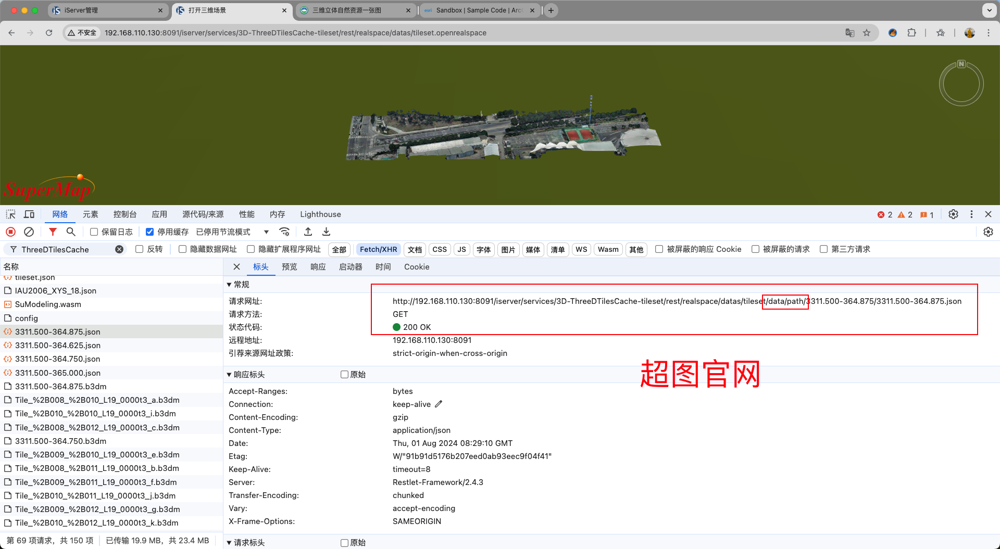

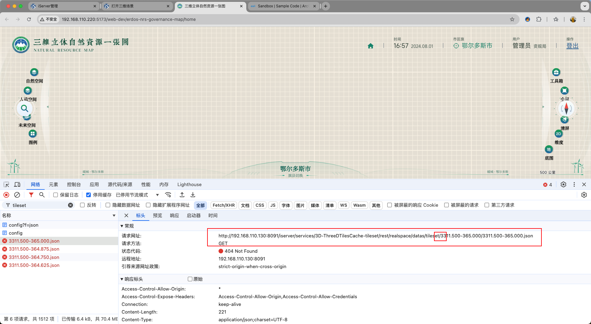

问题原因:

据超图技术人员所说，他们对底层有做改造，如果用其他 sdk 对接的话，可以直接用中间件发布 3dtiles

解决方案一：自行在请求前拼接 `/data/path/`

```js
import { useIntegratedMesh3dTilesLayer } from '@vuesri/core/composables'
import { useRequestInterceptor } from '@vuesri/core/composables/config'

const layer = useIntegratedMesh3dTilesLayer()

const basePattern = layer.url.replace('/config', '')
const regex = new RegExp(`${basePattern}/.*\\.(json|b3dm)$`)

const { interceptorToggle } = useRequestInterceptor({
  urls: [regex],
  before: (e) => {
    // 拼上'/data/path/'前缀
    e.url = e.url.replace(basePattern, `${basePattern}/data/path`)
  },
})
interceptorToggle.add()
```

解决方案二：

直接放在 iServer 安装目录 `\webapps` 下面也可以，就能浏览器访问到 `json` 文件

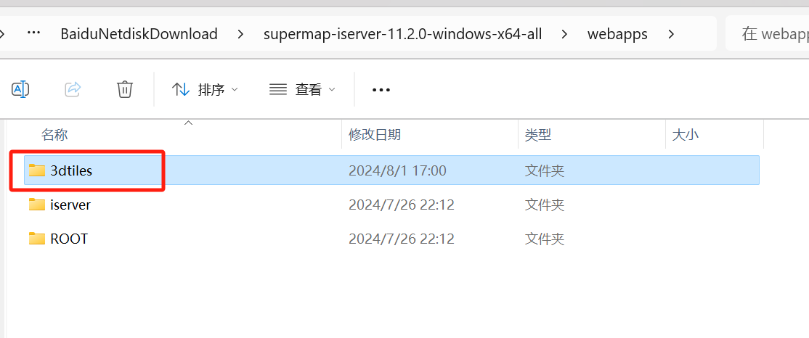

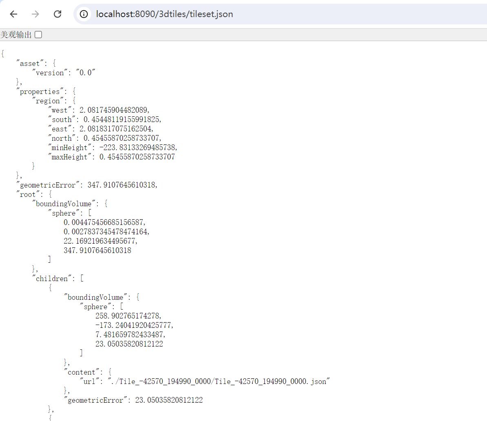
